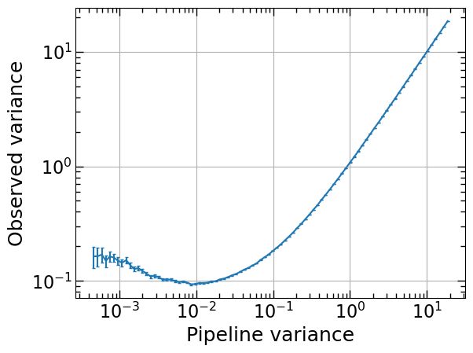
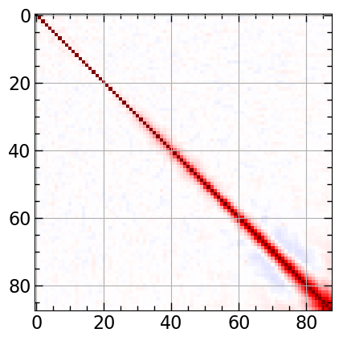
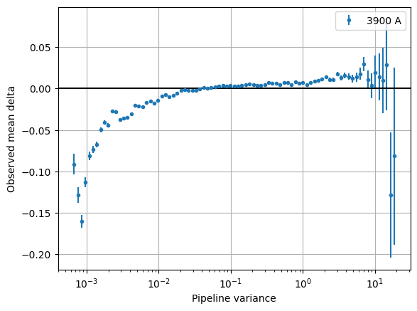

Look into output files
========================

This tutorial builds on the DESI early data release example detailed in :ref:`Quick Start <edr example and workaround>`. I assume you have access to the EDR data, created ``QSO_cat_fuji_healpix_only_qso_targets_sv3_fix.fits`` file that fixes the compatibility issue, and obtained deltas. An empty notebook can be found in the GitHub repo under ``docs/nb/look_into_output_files.ipynb`` or downloaded :download:`here <../../nb/look_into_output_files.ipynb>`.

.. code:: python3

    import fitsio
    import numpy as np
    import matplotlib.pyplot as plt

    # Point to output delta folder
    output_delta_folder = "Delta-co1"
    fchi2 = fitsio.FITS(f"{output_delta_folder}/continuum_chi2_catalog.fits")[1]
    fchi2

Output:

.. parsed-literal::

    
      file: Delta-co1/continuum_chi2_catalog.fits
      extension: 1
      type: BINARY_TBL
      extname: CHI2_CAT
      rows: 411359
      column info:
        TARGETID            i8  
        Z                   f4  
        HPXPIXEL            i8  
        ARMS                S5  
        MEANSNR             f4  array[3]
        RSNR                f4  
        MPI_RANK            i4  
        CONT_valid          b1  
        CONT_chi2           f4  
        CONT_dof            i4  
        CONT_x              f4  array[2]
        CONT_xcov           f4  array[4]

.. code:: python3

    chi2_data = fchi2.read()
    is_valid = chi2_data['CONT_valid']

    chi2_v = chi2_data[is_valid]['CONT_chi2'] / chi2_data[is_valid]['CONT_dof']
    
    plt.hist(chi2_v, bins=100)
    plt.axvline(1, c='k')
    plt.xlabel(r"$\chi^2_\nu$")
    plt.ylabel("Counts")
    plt.yscale("log")
    plt.show()

.. image:: ../_static/chi2cat_hist.png

Now let us investigate the ``attributes.fits`` file, which contains the mean continuum in ``CONT-i`` extensions, stacked fluxes in observed frame in ``STACKED_FLUX-i``, in rest-frame in ``STACKED_FLUX_RF-i`` extensions, and varlss-eta values in ``VAR_FUNC-i`` extenstions for all iterations.

.. code:: python3

    fattr = fitsio.FITS(f"{output_delta_folder}/attributes.fits")
    fattr

Output:

.. parsed-literal::

    
      file: Delta-co1/attributes.fits
      extnum hdutype         hduname[v]
      0      IMAGE_HDU       
      1      BINARY_TBL      CONT-1
      2      BINARY_TBL      STACKED_FLUX-1
      3      BINARY_TBL      STACKED_FLUX_RF-1
      4      BINARY_TBL      VAR_FUNC-1
      5      BINARY_TBL      CONT-2
      6      BINARY_TBL      STACKED_FLUX-2
      7      BINARY_TBL      STACKED_FLUX_RF-2
      8      BINARY_TBL      VAR_FUNC-2
      9      BINARY_TBL      CONT-3
      10     BINARY_TBL      STACKED_FLUX-3
      11     BINARY_TBL      STACKED_FLUX_RF-3
      12     BINARY_TBL      VAR_FUNC-3
      13     BINARY_TBL      CONT-4
      14     BINARY_TBL      STACKED_FLUX-4
      15     BINARY_TBL      STACKED_FLUX_RF-4
      16     BINARY_TBL      VAR_FUNC-4
      17     BINARY_TBL      CONT-5
      18     BINARY_TBL      STACKED_FLUX-5
      19     BINARY_TBL      STACKED_FLUX_RF-5
      20     BINARY_TBL      VAR_FUNC-5
      21     BINARY_TBL      CONT-6
      22     BINARY_TBL      STACKED_FLUX-6
      23     BINARY_TBL      STACKED_FLUX_RF-6
      24     BINARY_TBL      VAR_FUNC-6
      25     BINARY_TBL      CONT
      26     BINARY_TBL      STACKED_FLUX
      27     BINARY_TBL      STACKED_FLUX_RF
      28     BINARY_TBL      VAR_FUNC
      29     BINARY_TBL      VAR_STATS

.. code:: python3

    fattr['VAR_STATS']

Output:

.. parsed-literal::

    
      file: Delta-co1/attributes.fits
      extension: 29
      type: BINARY_TBL
      extname: VAR_STATS
      rows: 2500
      column info:
        wave                f8  
        var_pipe            f8  
        e_var_pipe          f8  
        var_delta           f8  
        e_var_delta         f8  
        mean_delta          f8  
        var2_delta          f8  
        num_pixels          i8  
        num_qso             i8  
        cov_var_delta       f8  array[100]

Note you will have ``cov_var_delta`` only if you ran ``qsonic-fit`` with ``--var-use-cov`` option.

.. code:: python3

    fattr['VAR_STATS'].read_header()

Output:

.. parsed-literal::

    
    XTENSION= 'BINTABLE'           / binary table extension
    BITPIX  =                    8 / 8-bit bytes
    NAXIS   =                    2 / 2-dimensional binary table
    NAXIS1  =                  872 / width of table in bytes
    NAXIS2  =                 2500 / number of rows in table
    PCOUNT  =                    0 / size of special data area
    GCOUNT  =                    1 / one data group (required keyword)
    TFIELDS =                   10 / number of fields in each row
    TTYPE1  = 'wave'               / label for field   1
    TFORM1  = 'D'                  / data format of field: 8-byte DOUBLE
    TTYPE2  = 'var_pipe'           / label for field   2
    TFORM2  = 'D'                  / data format of field: 8-byte DOUBLE
    TTYPE3  = 'e_var_pipe'         / label for field   3
    TFORM3  = 'D'                  / data format of field: 8-byte DOUBLE
    TTYPE4  = 'var_delta'          / label for field   4
    TFORM4  = 'D'                  / data format of field: 8-byte DOUBLE
    TTYPE5  = 'e_var_delta'        / label for field   5
    TFORM5  = 'D'                  / data format of field: 8-byte DOUBLE
    TTYPE6  = 'mean_delta'         / label for field   6
    TFORM6  = 'D'                  / data format of field: 8-byte DOUBLE
    TTYPE7  = 'var2_delta'         / label for field   7
    TFORM7  = 'D'                  / data format of field: 8-byte DOUBLE
    TTYPE8  = 'num_pixels'         / label for field   8
    TFORM8  = 'K'                  / data format of field: 8-byte INTEGER
    TTYPE9  = 'num_qso'            / label for field   9
    TFORM9  = 'K'                  / data format of field: 8-byte INTEGER
    TTYPE10 = 'cov_var_delta'      / label for field  10
    TFORM10 = '100D'               / data format of field: 8-byte DOUBLE
    EXTNAME = 'VAR_STATS'          / name of this binary table extension
    MINNPIX =                  500 / 
    MINNQSO =                   50 / 
    MINSNR  =                    0 / 
    MAXSNR  =                  100 / 
    WAVE1   =               3660.0 / 
    WAVE2   =               6540.0 / 
    NWBINS  =                   25 / 
    IVAR1   =                 0.05 / 
    IVAR2   =              10000.0 / 
    NVARBINS=                  100 / 

Plotting var_pipe vs var_obs for a wavelength bin
-------------------------------------------------

.. code:: python3

    hdr = fattr['VAR_STATS'].read_header()
    nwbins = hdr['NWBINS']
    nvarbins = hdr['NVARBINS']
    min_nqso = hdr['MINNQSO']
    min_npix = hdr['MINNPIX']
    del hdr
    
    var_stats_data = fattr['VAR_STATS'].read().reshape(nwbins, nvarbins)
    
    # Pick a wavelength bin to plot
    iw = 2
    dat = var_stats_data[iw]
    valid = (dat['num_qso'] >= min_nqso) & (dat['num_pixels'] >= min_npix)
    dat = dat[valid]
    
    plt.errorbar(
        dat['var_pipe'], dat['var_delta'], dat['e_var_delta'],
        fmt='.', alpha=1, label=f"{np.mean(dat['wave']):.0f} A")
    plt.xlabel("Pipeline variance")
    plt.ylabel("Observed variance")
    plt.xscale("log")
    plt.yscale("log")
    plt.grid()
    plt.legend()
    plt.show()

Plot covariance between these points
------------------------------------

.. code:: python3

    cov = dat['cov_var_delta'][:, valid]
    norm = np.sqrt(cov.diagonal())
    plt.imshow(cov / np.outer(norm, norm), vmin=-1, vmax=1, cmap=plt.cm.seismic)
    plt.gca().invert_yaxis()
    plt.gca().invert_xaxis()
    plt.show()

Plot var_pipe vs mean_delta
---------------------------

.. code:: python3

    plt.errorbar(
        dat['var_pipe'], dat['mean_delta'], np.sqrt(dat['var_delta'] / dat['num_pixels']),
        fmt='.', alpha=1, label=f"{np.mean(dat['wave']):.0f} A")
    plt.xlabel("Pipeline variance")
    plt.ylabel("Observed mean delta")
    plt.xscale("log")
    plt.grid()
    plt.axhline(0, c='k')
    plt.legend()
    plt.show()

