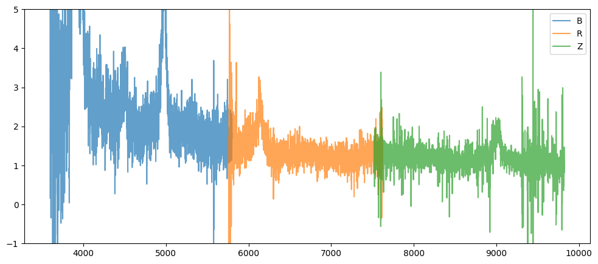
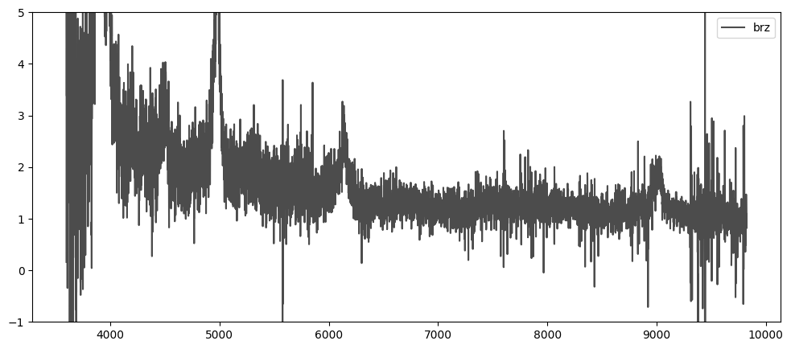

Tutorial
===========

Running qsonic-fit
-------------------------

``qsonic-fit`` performs the continuum fitting. You need MPI to run this command, therefore you need to use ``mpirun -np NUMBER_OF_TASKS qsonic-fit ...`` in general or ``srun -n NUMBER_OF_TASKS -c NUMBER_OF_CPUS qsonic-fit ...`` on systems with SLURM. Here is a typical qsonic command for SLURM:

.. code-block:: shell

    srun -n 128 -c 2 qsonic-fit \
    --input-dir INPUT_DIRECTORY \
    --catalog QUASAR_CATALOG \
    -o OUTPUT_FOLDER \
    --num-iterations 10 \
    --wave1 3600 --wave2 5500 \
    --forest-w1 1050 --forest-w2 1180 \
    --skip-resomat

See :ref:`qsonic-fit arguments <qsonic fit arguments>` for all options you can tweak in the continuum fitting.

.. _edr example and workaround:

Example: DESI early data release
--------------------------------

If you have a NERSC account, e.g. through DESI, DES, LSST-DESC, or other DOE-sponsored projects, DESI early data release (EDR) is available at ``/global/cfs/cdirs/desi/public/edr``. Otherwise follow the instructions to download the spectra using `Globus <https://data.desi.lbl.gov/doc/access/>`_. Note that you need 80 TB storage space, even though the data set we are going to use is much smaller (around 17 GB). Let us call this directory ``${EDR_DIRECTORY}``. The coadded spectra are in ``${EDR_DIRECTORY}/spectro/redux/fuji/healpix`` and the quasar catalog for the Lyman-alpha forest analysis is ``${EDR_DIRECTORY}/vac/edr/qso/v1.0/QSO_cat_fuji_healpix_only_qso_targets.fits``. QSOnic is designed to work on DESI data release 1 (DR1) (will be publicly available in late 2024/early 2025) and above. Unfortunately, the blinding strategy implemented for DR1 is not compatible with the EDR quasar catalogs, so we need a workaround.

**Workaround for EDR catalogs:** The blinding strategy requires ``LASTNIGHT`` column to be present in the quasar catalog, which is missing from ``QSO_cat_fuji_healpix_only_qso_targets.fits``. Furthermore, we need to limit our analysis to the relevant survey and program for the Lyman-alpha forest clustering analyses which is the 1% survey (SV3) and dark program. Following commands will read the EDR catalog, select SV3 quasars and append a constant ``LASTNIGHT`` column that marks the last night of observing for EDR. This catalog has 38,289 objects, of which ~11,000 are at redshifts ``z > 2.1`` and have their Lya forest region within DESI's wavelength coverage. You can find an **unofficial** copy of this catalog :download:`here <https://drive.google.com/file/d/1f95jSW8O1DUr2CxsJ2A688SgYfn7ltIL>`.

.. code-block:: python

    import fitsio
    from numpy.lib.recfunctions import append_fields

    org_catalog = fitsio.read(
        "${EDR_DIRECTORY}/vac/edr/qso/v1.0/QSO_cat_fuji_healpix_only_qso_targets.fits",
        ext=1)

    # select quasars in SV3-dark and append LASTNIGHT column
    new_catalog = append_fields(
        org_catalog[(org_catalog['SURVEY'] == 'sv3') & (org_catalog['PROGRAM'] == 'dark')],
        'LASTNIGHT', [20210513], dtypes=int, usemask=False)

    with fitsio.FITS(
            "QSO_cat_fuji_healpix_only_qso_targets_sv3_fix.fits", 'rw',
            clobber=True
    ) as fts:
        fts.write(new_catalog, extname='ZCATALOG')

Now we can pass this catalog into ``qsonic-fit`` script as the quasar catalog.

.. code-block:: shell

    srun -n 16 -c 2 qsonic-fit \
    --input-dir ${EDR_DIRECTORY}/spectro/redux/fuji/healpix \
    --catalog QSO_cat_fuji_healpix_only_qso_targets_sv3_fix.fits \
    --keep-surveys sv3 \
    -o OUTPUT_FOLDER \
    --num-iterations 10 \
    --wave1 3600 --wave2 5500 \
    --forest-w1 1040 --forest-w2 1200 \
    --skip-resomat

Note we passed ``--keep-surveys sv3`` argument to the script, and you still need to pass a valid output folder. This minimal example should calculate quasar continua for about 11,000 spectra. It requires less than 1 GB of RAM and should finish in about a minute for 16 MPI tasks with two cores each. The output files require 320 MB storage. Reading the resolution matrix (by removing ``--skip-resomat`` option) multiplies the storage and RAM requirements by a factor of four and slows down reading/writing data. This slow down is neglible for this example, but are relevant for large samples.

Look into output files
----------------------

An empty notebook can be found in the GitHub repo under ``docs/nb/look_into_output_files.ipynb`` or downloaded :download:`here <../nb/look_into_output_files.ipynb>`.

.. code:: python3

    import fitsio
    import numpy as np
    import matplotlib.pyplot as plt

    # Point to output delta folder
    output_delta_folder = "Delta-co1"
    fchi2 = fitsio.FITS(f"{output_delta_folder}/continuum_chi2_catalog.fits")[1]
    fchi2

Output:

.. parsed-literal::

    
      file: Delta-co1/continuum_chi2_catalog.fits
      extension: 1
      type: BINARY_TBL
      extname: CHI2_CAT
      rows: 411359
      column info:
        TARGETID            i8  
        Z                   f4  
        HPXPIXEL            i8  
        ARMS                S5  
        MEANSNR             f4  array[3]
        RSNR                f4  
        MPI_RANK            i4  
        CONT_valid          b1  
        CONT_chi2           f4  
        CONT_dof            i4  
        CONT_x              f4  array[2]
        CONT_xcov           f4  array[4]

.. code:: python3

    chi2_data = fchi2.read()
    is_valid = chi2_data['CONT_valid']

    chi2_v = chi2_data[is_valid]['CONT_chi2'] / chi2_data[is_valid]['CONT_dof']
    
    plt.hist(chi2_v, bins=100)
    plt.axvline(1, c='k')
    plt.xlabel(r"$\chi^2_\nu$")
    plt.ylabel("Counts")
    plt.yscale("log")
    plt.show()

.. image:: _static/chi2cat_hist.png

Now let us investigate the ``attributes.fits`` file, which contains the mean continuum in ``CONT-i`` extensions, stacked fluxes in observed frame in ``STACKED_FLUX-i``, in rest-frame in ``STACKED_FLUX_RF-i`` extensions, and varlss-eta values in ``VAR_FUNC-i`` extenstions for all iterations.

.. code:: python3

    fattr = fitsio.FITS(f"{output_delta_folder}/attributes.fits")
    fattr

Output:

.. parsed-literal::

    
      file: Delta-co1/attributes.fits
      extnum hdutype         hduname[v]
      0      IMAGE_HDU       
      1      BINARY_TBL      CONT-1
      2      BINARY_TBL      STACKED_FLUX-1
      3      BINARY_TBL      STACKED_FLUX_RF-1
      4      BINARY_TBL      VAR_FUNC-1
      5      BINARY_TBL      CONT-2
      6      BINARY_TBL      STACKED_FLUX-2
      7      BINARY_TBL      STACKED_FLUX_RF-2
      8      BINARY_TBL      VAR_FUNC-2
      9      BINARY_TBL      CONT-3
      10     BINARY_TBL      STACKED_FLUX-3
      11     BINARY_TBL      STACKED_FLUX_RF-3
      12     BINARY_TBL      VAR_FUNC-3
      13     BINARY_TBL      CONT-4
      14     BINARY_TBL      STACKED_FLUX-4
      15     BINARY_TBL      STACKED_FLUX_RF-4
      16     BINARY_TBL      VAR_FUNC-4
      17     BINARY_TBL      CONT-5
      18     BINARY_TBL      STACKED_FLUX-5
      19     BINARY_TBL      STACKED_FLUX_RF-5
      20     BINARY_TBL      VAR_FUNC-5
      21     BINARY_TBL      CONT-6
      22     BINARY_TBL      STACKED_FLUX-6
      23     BINARY_TBL      STACKED_FLUX_RF-6
      24     BINARY_TBL      VAR_FUNC-6
      25     BINARY_TBL      CONT
      26     BINARY_TBL      STACKED_FLUX
      27     BINARY_TBL      STACKED_FLUX_RF
      28     BINARY_TBL      VAR_FUNC
      29     BINARY_TBL      VAR_STATS

.. code:: python3

    fattr['VAR_STATS']

Output:

.. parsed-literal::

    
      file: Delta-co1/attributes.fits
      extension: 29
      type: BINARY_TBL
      extname: VAR_STATS
      rows: 2500
      column info:
        wave                f8  
        var_pipe            f8  
        e_var_pipe          f8  
        var_delta           f8  
        e_var_delta         f8  
        mean_delta          f8  
        var2_delta          f8  
        num_pixels          i8  
        num_qso             i8  
        cov_var_delta       f8  array[100]

Note you will have ``cov_var_delta`` only if you ran ``qsonic-fit`` with ``--var-use-cov`` option.

.. code:: python3

    fattr['VAR_STATS'].read_header()

Output:

.. parsed-literal::

    
    XTENSION= 'BINTABLE'           / binary table extension
    BITPIX  =                    8 / 8-bit bytes
    NAXIS   =                    2 / 2-dimensional binary table
    NAXIS1  =                  872 / width of table in bytes
    NAXIS2  =                 2500 / number of rows in table
    PCOUNT  =                    0 / size of special data area
    GCOUNT  =                    1 / one data group (required keyword)
    TFIELDS =                   10 / number of fields in each row
    TTYPE1  = 'wave'               / label for field   1
    TFORM1  = 'D'                  / data format of field: 8-byte DOUBLE
    TTYPE2  = 'var_pipe'           / label for field   2
    TFORM2  = 'D'                  / data format of field: 8-byte DOUBLE
    TTYPE3  = 'e_var_pipe'         / label for field   3
    TFORM3  = 'D'                  / data format of field: 8-byte DOUBLE
    TTYPE4  = 'var_delta'          / label for field   4
    TFORM4  = 'D'                  / data format of field: 8-byte DOUBLE
    TTYPE5  = 'e_var_delta'        / label for field   5
    TFORM5  = 'D'                  / data format of field: 8-byte DOUBLE
    TTYPE6  = 'mean_delta'         / label for field   6
    TFORM6  = 'D'                  / data format of field: 8-byte DOUBLE
    TTYPE7  = 'var2_delta'         / label for field   7
    TFORM7  = 'D'                  / data format of field: 8-byte DOUBLE
    TTYPE8  = 'num_pixels'         / label for field   8
    TFORM8  = 'K'                  / data format of field: 8-byte INTEGER
    TTYPE9  = 'num_qso'            / label for field   9
    TFORM9  = 'K'                  / data format of field: 8-byte INTEGER
    TTYPE10 = 'cov_var_delta'      / label for field  10
    TFORM10 = '100D'               / data format of field: 8-byte DOUBLE
    EXTNAME = 'VAR_STATS'          / name of this binary table extension
    MINNPIX =                  500 / 
    MINNQSO =                   50 / 
    MINSNR  =                    0 / 
    MAXSNR  =                  100 / 
    WAVE1   =               3660.0 / 
    WAVE2   =               6540.0 / 
    NWBINS  =                   25 / 
    IVAR1   =                 0.05 / 
    IVAR2   =              10000.0 / 
    NVARBINS=                  100 / 

Plotting var_pipe vs var_obs for a wavelength bin
^^^^^^^^^^^^^^^^^^^^^^^^^^^^^^^^^^^^^^^^^^^^^^^^^

.. code:: python3

    hdr = fattr['VAR_STATS'].read_header()
    nwbins = hdr['NWBINS']
    nvarbins = hdr['NVARBINS']
    min_nqso = hdr['MINNQSO']
    min_npix = hdr['MINNPIX']
    del hdr
    
    var_stats_data = fattr['VAR_STATS'].read().reshape(nwbins, nvarbins)
    
    # Pick a wavelength bin to plot
    iw = 2
    dat = var_stats_data[iw]
    valid = (dat['num_qso'] >= min_nqso) & (dat['num_pixels'] >= min_npix)
    dat = dat[valid]
    
    plt.errorbar(
        dat['var_pipe'], dat['var_delta'], dat['e_var_delta'],
        fmt='.', alpha=1, label=f"{np.mean(dat['wave']):.0f} A")
    plt.xlabel("Pipeline variance")
    plt.ylabel("Observed variance")
    plt.xscale("log")
    plt.yscale("log")
    plt.grid()
    plt.legend()
    plt.show()

.. image:: _static/chi2cat_varpipe-obs.png

Plot covariance between these points
^^^^^^^^^^^^^^^^^^^^^^^^^^^^^^^^^^^^

.. code:: python3

    cov = dat['cov_var_delta'][:, valid]
    norm = np.sqrt(cov.diagonal())
    plt.imshow(cov / np.outer(norm, norm), vmin=-1, vmax=1, cmap=plt.cm.seismic)
    plt.gca().invert_yaxis()
    plt.gca().invert_xaxis()
    plt.show()

.. image:: _static/chi2cat_covariance.png

Plot var_pipe vs mean_delta
^^^^^^^^^^^^^^^^^^^^^^^^^^^

.. code:: python3

    plt.errorbar(
        dat['var_pipe'], dat['mean_delta'], np.sqrt(dat['var_delta'] / dat['num_pixels']),
        fmt='.', alpha=1, label=f"{np.mean(dat['wave']):.0f} A")
    plt.xlabel("Pipeline variance")
    plt.ylabel("Observed mean delta")
    plt.xscale("log")
    plt.grid()
    plt.axhline(0, c='k')
    plt.legend()
    plt.show()

.. image:: _static/chi2cat_varpipe-mean.png

Running qsonic-calib
--------------------

``qsonic-calib`` calculates var_lss and eta terms for a given set of deltas. This script does not perform continuum fitting, and so it enables fast calculations of var_lss and eta for data SNR splits, parameter variations in wavelength and variance binning. Using the same ``OUTPUT_FOLDER`` that we saved our deltas, you can run ``qsonic-calib`` for SNR>2 deltas with 200 variance bins as follows:

.. code:: shell

    srun -n 16 -c 2 qsonic-calib \
    -i OUTPUT_FOLDER -o OUTPUT_FOLDER \
    --nvarbins 200 --var-use-cov --min-snr 2 \
    --wave1 3600 --wave2 5500 \
    --forest-w1 1040 --forest-w2 1200

Reading spectra
---------------

Here's an example code snippet to use IO interface following the EDR instructions above. See below for a step by step tutorial.

.. code-block:: python

    import numpy as np
    import qsonic.catalog
    import qsonic.io

    fname_catalog = "QSO_cat_fuji_healpix_only_qso_targets_sv3_fix.fits"
    indir = "${EDR_DIRECTORY}/spectro/redux/fuji/healpix"
    arms = ['B', 'R']
    is_mock = False
    skip_resomat = True

    # Setup reader function
    readerFunction = qsonic.io.get_spectra_reader_function(
        indir, arms, is_mock, skip_resomat,
        read_true_continuum=False, is_tile=False)

    w1 = 3600.
    w2 = 6000.
    fw1 = 1050.
    fw2 = 1180.

    catalog = qsonic.catalog.read_quasar_catalog(fname_catalog, is_mock=is_mock)

    # Group into unique pixels
    unique_pix, s = np.unique(catalog['HPXPIXEL'], return_index=True)
    split_catalog = np.split(catalog, s[1:])

    # You can parallelize this such that each process reads a healpix.
    # e.g., pool.map(parallel_reading, split_catalog)
    for hpx_cat in split_catalog:
        healpix = hpx_cat['HPXPIXEL'][0]

        spectra_by_hpx = readerFunction(hpx_cat)

        # Do stuff with spectra in this healpix
        ...

Simple coadd showcase
---------------------

An empty notebook can be found in the GitHub repo under ``docs/nb/simple_coadd_showcase.ipynb`` or downloaded :download:`here <../nb/simple_coadd_showcase.ipynb>`.

For this example, we are going to read all arms (B, R, Z), but will not read the resolution matrix.

.. code:: python3

    import numpy as np
    import matplotlib.pyplot as plt
    
    import qsonic.catalog
    import qsonic.io

    fname_catalog = "QSO_cat_fuji_healpix_only_qso_targets_sv3_fix.fits"
    indir = "${EDR_DIRECTORY}/spectro/redux/fuji/healpix"
    arms = ['B', 'R', 'Z']
    is_mock = False
    skip_resomat = True

    # Setup reader function
    readerFunction = qsonic.io.get_spectra_reader_function(
        indir, arms, is_mock, skip_resomat,
        read_true_continuum=False, is_tile=False)

First, we read the catalog. Since ``qsonic`` sorts this the catalog by
HPXPIXEL, we can find the unique healpix values and split the catalog
into healpix groups. For example purposes, we are picking a single healpix and
reading all the quasar spectra in that file.

.. code:: python3

    catalog = qsonic.catalog.read_quasar_catalog(fname, is_mock=is_mock)

    # Group into unique pixels
    unique_pix, s = np.unique(catalog['HPXPIXEL'], return_index=True)
    split_catalog = np.split(catalog, s[1:])

    # Pick one healpix to illustrate
    hpx_cat = split_catalog[1]
    healpix = hpx_cat['HPXPIXEL'][0]

    spectra_by_hpx = readerFunction(hpx_cat)

    print(f"There are {len(spectra_by_hpx)} spectra in healpix {healpix}.")

.. parsed-literal::

    There are 71 spectra in healpix 9145.

Plot one spectrum
^^^^^^^^^^^^^^^^^

Let’s investigate one spectrum. Wavelength, flux and inverse variance
are stored as dictionaries similar to
`desispec.spectra.Spectra <https://desispec.readthedocs.io/en/latest/api.html#desispec-spectra>`_.

.. code:: python3

    spec = spectra_by_hpx[3]
    print(spec.wave)
    print(spec.flux)

.. parsed-literal::

    {'B': array([3600. , 3600.8, 3601.6, ..., 5798.4, 5799.2, 5800. ]),
     'R': array([5760. , 5760.8, 5761.6, ..., 7618.4, 7619.2, 7620. ]),
     'Z': array([7520. , 7520.8, 7521.6, ..., 9822.4, 9823.2, 9824. ])}
    {'B': array([0.16013083, 2.1076498 , 6.495008  , ..., 2.2043223 , 1.6862453 ,
        1.8163666 ], dtype=float32),
     'R': array([-1.287594  ,  1.731283  ,  0.62619126, ...,  0.9037217 ,
        1.3648763 ,  1.652868  ], dtype=float32),
     'Z': array([0.83304965, 1.031328  , 1.6591258 , ..., 0.81355166, 1.0301682 ,
        1.0923132 ], dtype=float32)}

.. code:: python3

    plt.figure(figsize=(12, 5))
    for arm, wave_arm in spec.wave.items():
        plt.plot(wave_arm, spec.flux[arm], label=arm, alpha=0.7)
    plt.legend()
    plt.ylim(-1, 5)
    plt.show()

Plot coadded spectrum
^^^^^^^^^^^^^^^^^^^^^

Now, we coadd the arms using inverse variance and replot. The spectrum
attributes will still be dictionaries with a single key ``brz`` no
matter which arms are used to coadd.

.. code:: python3

    spec.simple_coadd()
    print(spec.wave)
    print(spec.flux)

.. parsed-literal::

    {'brz': array([3600. , 3600.8, 3601.6, ..., 9822.4, 9823.2, 9824. ])}
    {'brz': array([0.16013082, 2.10764978, 6.49500805, ..., 0.81355166, 1.03016822,
        1.0923132 ])}

.. code:: python3

    plt.figure(figsize=(12, 5))
    for arm, wave_arm in spec.wave.items():
        plt.plot(wave_arm, spec.flux[arm], label=arm, alpha=0.7, c='k')
    plt.legend()
    plt.ylim(-1, 5)
    plt.show()

